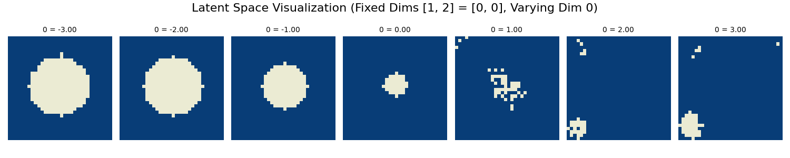
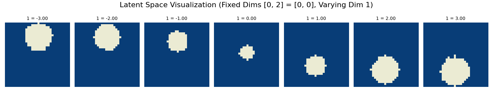
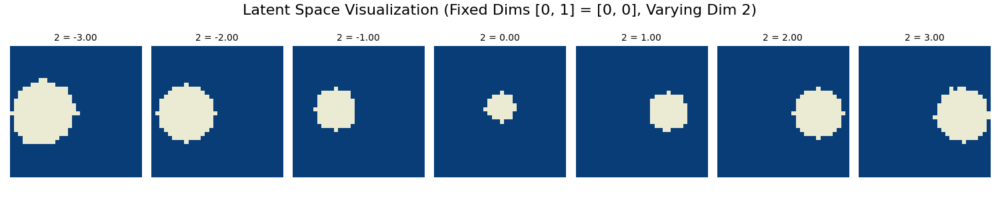

# Variational AutoEncoder Tiny Model

# Variational AutoEncoder

This project demonstrates the use of a Variational AutoEncoder (VAE) to learn a latent space representation of simple synthetic data: black-and-white images of circles with varying radius, x, and y coordinates. The goal is to map these parameters to a 3-dimensional latent space, where each dimension ideally corresponds to one of the circle's properties.

##  The Data

The dataset consists of black-and-white images of circles, each of shape 32x32, generated using opencv's `cv2.circle `function. Each image contains a single circle, randomly positioned and sized within the frame. The parameters for the circles are:

- `Radius`: Randomly selected within a defined range.
- `X-coordinate`: Random horizontal position of the circle's center.
- `Y-coordinate`: Random vertical position of the circle's center.

Below is a sample visualization of the generated data:

# The Encoder

The encoder network compresses the flattened 32x32 input image into a 3-dimensional latent representation. It consists entirely of fully connected layers, producing two outputs:

- Mean vector (μ) of the latent distribution.
- Log variance vector (logσ2) of the latent distribution.

# The Decoder

The decoder reconstructs the original image from the 3-dimensional latent representation. It also consists entirely of fully connected layers, ensuring the output matches the flattened dimensions of the original image (32x32).

# The Latent Space

The latent space is a 3-dimensional representation of the circle data. Ideally, each dimension captures a specific property:

## First dimension

The radius?

## Second dimension

The Y-axis?

## Third dimension

The X-axis?

## Future Work
- [ ]  Add Beta-VAE

## Contributing

Contributions are welcome! Please feel free to submit a Pull Request. For major changes, please open an issue first to discuss what you would like to change.

1. Fork the repository
2. Create your feature branch (`git checkout -b feature/AmazingFeature`)
3. Commit your changes (`git commit -m 'Add some AmazingFeature'`)
4. Push to the branch (`git push origin feature/AmazingFeature`)
5. Open a Pull Request

Made with ❤️ by [Fer14]
